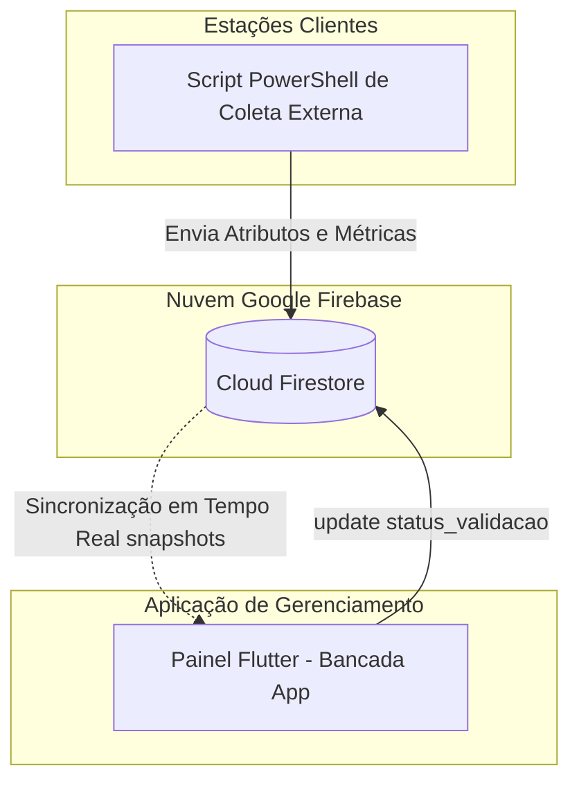

# README Técnico do Projeto: Bancada App (Inventário Inteligente URE - PI IV UNIVESP)

Este documento apresenta uma análise técnica minuciosa e fiel ao código-fonte do sistema **Bancada App**, documentando seus fluxos de funcionamento, mecanismos de identificação, arquitetura e aspectos de segurança. O objetivo desta documentação é registrar as implementações reais constatadas no código para permitir auditorias e futuras comparações de segurança.

---

# 1. Visão geral

* **Objetivo do projeto:** O sistema consiste em um painel de gerenciamento e inventário preditivo de ativos computacionais da URE (Unidade de Recursos Estruturais), integrando a coleta de dados de estações e a exibição de métricas de integridade e risco de falhas.
* **Problema que resolve:** Centraliza o monitoramento de um parque de máquinas distribuído (ex.: laboratórios de informática em escolas), permitindo identificar equipamentos com alta probabilidade de falha ou pendências de validação cadastral.
* **Quem utiliza o sistema:** Administradores de rede, equipes de suporte técnico de TI e gestores do parque tecnológico.
* **Principais componentes:** 
  * Aplicação Front-end/Dashboard desenvolvida em Flutter.
  * Banco de Dados NoSQL em nuvem (Google Cloud Firestore).
  * Mecanismo externo de coleta de dados de estações (mencionado conceitualmente via scripts do PowerShell).
* **Tecnologias utilizadas:** Flutter SDK, Linguagem Dart, pacotes `firebase_core`, `cloud_firestore` (com persistência offline habilitada para resiliência), `fl_chart` (para renderização gráfica de distribuição de riscos) e `intl`.
* **Papel do Arduino:** **Não identificado no código**. Não há qualquer arquivo de firmware (`.ino`/`.cpp`), importação de bibliotecas de comunicação serial (`flutter_libserialport` ou similares), ou referências a hardware microcontrolado no código-fonte analisado.

---

# 2. Objetivo de segurança

O sistema visa centralizar a visualização do estado de conformidade e riscos das estações de trabalho cadastradas. Com base estrita no código-fonte, o comportamento em relação aos objetivos listados é detalhado a seguir:

* **O sistema precisa garantir que uma máquina seja realmente aquela que afirma ser?** Não há mecanismos criptográficos de assinatura de máquina, atestação de hardware ou autenticação mútua no código para garantir a identidade genuína do remetente.
* **Existe algum mecanismo para diferenciar uma máquina legítima de uma máquina desconhecida?** A diferenciação é puramente baseada no campo textual `status_validacao` contido no documento lido do banco de dados. Máquinas com status `'QUARENTENA'` ou `'NAO_RESPONDIDO'` são tratadas pela aplicação como pendentes/desconhecidas.
* **Existe autenticação da máquina?** Não identificado no código.
* **Existe autenticação do Arduino?** Não aplicável (Arduino não identificado no código).
* **Existe validação da identidade física da máquina?** Não há rotinas que efetuem verificação de integridade física ou vínculos de hardware imutáveis.
* **O sistema possui algum mecanismo para impedir falsificação ou clonagem?** Não há blindagem ou assinatura digital que impeça uma entidade maliciosa de criar um registro no banco de dados simulando atributos de outra máquina.
* **O que exatamente é considerado uma "máquina válida" ou "máquina genuína"?** Conceitualmente, no escopo do software, é qualquer registro cuja propriedade `status_validacao` seja diferente de `'QUARENTENA'` ou `'NAO_RESPONDIDO'` (por exemplo, após aprovação manual, o status muda para `'VALIDADO_MANUAL'`).

---

# 3. Arquitetura

A arquitetura do sistema segue um modelo direto de comunicação cliente-servidor (Serverless), onde a aplicação cliente Flutter conecta-se e interage diretamente com o serviço de banco de dados na nuvem, sem intermediação de um backend dedicado personalizado visível no código.

### Componentes Identificados:
* **Computador/Máquina Cliente:** Estações monitoradas do parque de TI (mencionadas no arquivo `dashboard_screen.dart` como coletadas via script PowerShell externo).
* **Aplicação:** Aplicativo Flutter (`bancada_app`) estruturado com navegação por abas (`HomeShell`) e visualização analítica.
* **Arduino:** **Não identificado no código**.
* **Banco de dados / Servidor:** Google Cloud Firestore, acessado diretamente via SDK oficial da coleção `equipamentos`.
* **APIs / Serviços Adicionais:** Firebase Core para inicialização do ecossistema de nuvem.

---

# 4. Fluxo completo de funcionamento

O fluxo real de processamento executado pela aplicação ocorre da seguinte forma:

1. A aplicação Flutter inicia chamando o método `main()`.
2. O ecossistema do Firebase é inicializado através de `Firebase.initializeApp()`.
3. A persistência em cache local off-line do Firestore é explicitamente habilitada e configurada com tamanho ilimitado (`Settings.CACHE_SIZE_UNLIMITED`).
4. A tela principal (`HomeShell`) é instanciada, renderizando uma barra de navegação adaptativa (usando `NavigationRail` para telas largas e `NavigationBar` para telas estreitas).
5. Ao carregar a aba **Painel Coletor** (`DashboardScreen`), a aplicação estabelece um stream contínuo via `snapshots()` escutando a coleção `'equipamentos'` do Firestore.
6. O Firestore retorna a lista de documentos ativos. Cada documento é convertido em um objeto Dart por meio do factory `Maquina.fromMap(d.id, d.data())`.
7. O aplicativo processa a lista localmente na memória para calcular o total de equipamentos, máquinas com risco crítico, máquinas em atenção e em quarentena.
8. Os dados normalizados alimentam um gráfico de barras (`BarChart` do pacote `fl_chart`) que exibe a contagem de máquinas por faixa de risco.
9. Se o usuário navegar até a aba de **Quarentena** (`QuarentenaScreen`), um filtro exibe apenas itens onde `emQuarentena` é verdadeiro (`status_validacao == 'QUARENTENA' || status_validacao == 'NAO_RESPONDIDO'`).
10. O operador pode interagir com duas ações diretas que modificam o banco de dados:
    * **Aprovar:** Abre um diálogo solicitando "Escola" e "Sala" e dispara um comando de atualização direto no documento correspondente alterando `status_validacao` para `'VALIDADO_MANUAL'`.
    * **Descartar:** Dispara um comando de atualização direto alterando `status_validacao` para `'DESCARTADO'`.

---

# 5. Identificação da máquina

A identificação das máquinas baseia-se em um conjunto de atributos textuais enviados ao banco de dados Firestore. A classe de modelo `Maquina` mapeia esses dados da seguinte forma:

* **Atributos coletados e expostos:**
  * `idDispositivo` (Mapeia diretamente para o identificador exclusivo/ID do documento no Firestore; exposto pelo getter `serialBios`).
  * `tipo_identificador` (String descritiva do tipo de ID coletado).
  * `hostname` (Nome de rede do computador, mapeado para o getter `modeloPc`).
  * `processador` (Especificação técnica do processador, mapeado para o getter `cpu`).
  * `memoria_ram_gb` (Quantidade de memória RAM em formato numérico flutuante).
  * `risco_falha` (Valor numérico double indicando o índice preditivo de falha).
  * `status_validacao` (Estado de validação da máquina).
  * `data_registro` (Data/hora em formato ISO 8601).
* **Transformações e Hashing:** Não há rotinas de criptografia, geração de hashes (MD5, SHA256) ou ofuscação de dados implementadas no código do aplicativo Flutter.
* **Persistência local do ID:** O ID do dispositivo é o próprio identificador do documento registrado no Firestore. A aplicação realiza uma busca global na coleção inteira sem chaves locais salvas no dispositivo via `SharedPreferences` ou `SecureStorage`.

---

# 6. Arduino

Esta seção documenta a participação do hardware Arduino no projeto.

## 6.1 O Arduino apenas controla LEDs/atuadores?
**Não identificado no código.** Não há saídas, pinos ou acionamentos de atuadores previstos.

## 6.2 O Arduino participa da autenticação da máquina?
**Não identificado no código.** O fluxo de dados opera de maneira totalmente independente de qualquer componente microcontrolado.

## 6.3 O Arduino possui uma identidade própria?
**Não identificado no código.**

## 6.4 O Arduino armazena algum segredo?
**Não identificado no código.**

## 6.5 O Arduino realiza algum cálculo criptográfico?
**Não identificado no código.**

## 6.6 O Arduino valida alguma informação recebida da máquina?
**Não identificado no código.**

## 6.7 O Arduino gera alguma informação que a aplicação usa para autenticar a máquina?
**Não identificado no código.**

> [!IMPORTANT]
> **Constatação de Auditoria:** O Arduino é completamente ausente de todas as camadas de software deste repositório. O sistema de controle de inventário apoia-se inteiramente no envio de dados de telemetria de software gerados por sistemas operacionais (PowerShell) salvos no Firestore.

---

# 7. Comunicação entre computador e Arduino

* **Interface e meio físico:** **Não identificado no código**. Nenhuma conexão via USB, USART, Portas Seriais (COM), Bluetooth RFCOMM ou conexões de rede locais com microcontroladores está implementada no código-fonte.
* **Protocolo e Comandos:** Não aplicável (Inexistente no código analisado).

---

# 8. Autenticação

* **Mecanismo de autenticação mútua:** Não há rotinas de autenticação implementadas no código para verificar a identidade dos clientes que acessam o painel, nem validação de identidade dos coletores de dados das máquinas.
* **Segredos e Assinaturas:** O Firebase Core inicializa a conexão usando parâmetros estáticos públicos de configuração (contidos em `firebase_options.dart`). Não é utilizado o módulo Firebase Auth no código para autenticação de usuários administradores (login/senha ou tokens JWT).
* **Proteção contra repetição:** Não existem chaves simétricas/assimétricas, certificados digitais, geradores de HMAC, nonces ou contadores de mensagens estruturados na camada do aplicativo para autenticação de dispositivos.

---

# 9. Challenge-response

> [!NOTE]
> Não foi identificado mecanismo de challenge-response no código analisado.

---

# 10. Proteção contra replay

Não há implementação de travas temporais (timestamps de expiração de payload), números aleatórios de uso único (nonces), contadores incrementais ou assinaturas criptográficas vinculadas às mensagens no código do aplicativo. O sistema processa os valores vigentes contidos nos documentos lidos do Firestore de forma assíncrona.

---

# 11. Clonagem

Do ponto de vista puramente técnico do código analisado, a identidade de uma máquina é definida pela existência de um ID de documento e campos associados como `hostname` e `processador`. 
* **Riscos de segurança identificados:** Se um agente externo obtiver as credenciais de identificação do projeto do Firebase (que estão em texto claro no arquivo `firebase_options.dart`), ele poderá simular o comportamento do script de coleta e criar/modificar documentos no Firestore utilizando o ID de qualquer máquina legítima, clonando sua identidade e sobrescrevendo seus dados de inventário ou métricas de risco sem impedimentos por parte da aplicação.

---

# 12. Manipulação da aplicação

Em cenários onde um usuário possui privilégios administrativos na máquina local que executa o painel de gerenciamento:
* **Remoção de componentes:** Como não há acoplamento ou chamadas para o Arduino no código, não há rotinas de validação periférica que possam ser removidas.
* **Alteração dos resultados de validação:** A lógica de validação de dados em busca (`_sanitizar()`) e as funções de aprovação (`aprovarMaquina`) ocorrem diretamente no código do cliente Flutter. Um usuário que modifique o binário da aplicação ou intercepte as requisições pode submeter atualizações arbitrárias ao Firestore.
* **Validação no Servidor:** Não há evidências de regras de validação baseadas em Cloud Functions ou servidores intermediários de backend no código do projeto. A aplicação cliente envia comandos de atualização diretamente para a instância do Firestore (`_db.collection('equipamentos').doc(id).update(...)`), indicando que o servidor confia nas instruções enviadas pelo aplicativo cliente, dependendo exclusivamente das regras de segurança configuradas nativamente no console do Cloud Firestore (não visíveis no código-fonte).

---

# 13. Banco de dados e backend

* **Banco de dados utilizado:** Google Cloud Firestore (NoSQL Document Database).
* **Informações guardadas da máquina:** Os documentos da coleção `'equipamentos'` contêm chaves estruturadas para: `tipo_identificador`, `hostname`, `processador`, `memoria_ram_gb`, `status_validacao`, `data_registro` e `risco_falha`.
* **Informações guardadas do Arduino:** Nenhuma informação armazenada (Inexistente).
* **Vinculação ao cadastro:** A máquina é vinculada ao seu registro pelo ID exclusivo do documento Firestore (`d.id`), mapeado internamente para `idDispositivo`.
* **Regras de segurança e acesso:** O código do aplicativo Flutter possui permissões explícitas para ler a coleção inteira (`.snapshots()`) e gravar atualizações em campos específicos (`.update()`). O controle de quem pode criar ou apagar registros não está descrito no código, dependendo das configurações de segurança internas da nuvem Firebase.

---

# 14. Máquina desconhecida / quarentena

* **Detecção:** Ocorre de forma reativa pela leitura do campo `status_validacao`. A classe `Maquina` expõe o método `get emQuarentena`, que retorna verdadeiro se o valor textual for `'QUARENTENA'` ou `'NAO_RESPONDIDO'`.
* **Comportamento pós-detecção:** O equipamento é classificado visualmente com a categoria `FaixaRisco.critico`, exibindo um rótulo visual contendo o texto `"ALTO"` em vermelho (`risco_badge.dart`). Adicionalmente, o equipamento passa a ser exibido na tela `QuarentenaScreen`.
* **Processo de liberação:** A liberação ocorre através de uma intervenção manual do usuário na interface, disparando o método `aprovarMaquina(id, escola, sala)`, que atualiza o status do equipamento diretamente no banco para `'VALIDADO_MANUAL'`.
* **Contorno da quarentena:** Como a aplicação executa a query e atualização diretamente no cliente, um atacante com acesso direto ao banco ou que manipule a lógica local do Flutter pode contornar a quarentena alterando o estado do atributo de forma arbitrária.

---

# 15. Modelo de ameaça

### A. Máquina falsificada
* **Relevância do ataque:** Alta. Uma máquina desconhecida pode enviar dados ao banco fingindo ser um ativo legítimo.
* **Mecanismo de proteção:** Não há verificação ou barreira criptográfica no código analisado para impedir a falsificação de atributos textuais básicos.

### B. Arduino clonado
* **Relevância do ataque:** Não relevante. Não há código ou suporte para Arduino implementado no sistema.

### C. Replay
* **Relevância do ataque:** Alta. Um estado ou payload de atualização antigo capturado pode ser reenviado diretamente ao banco de dados para reverter ações legítimas de suporte.
* **Mecanismo de proteção:** Não foram identificados tokens de uso único, carimbos de tempo (timestamps) de validação de expiração ou assinaturas para mitigar ataques de replay.

### D. Aplicação modificada
* **Relevância do ataque:** Alta. Usuários maliciosos podem modificar a lógica do aplicativo Flutter local para ignorar filtros de quarentena ou forçar aprovações automáticas.
* **Mecanismo de proteção:** A aplicação confia nas operações locais; não há mecanismos de atestação de integridade do binário (como checagem de assinatura de app) presentes no código-fonte.

### E. Comunicação interceptada
* **Relevância do ataque:** Média. 
* **Mecanismo de proteção:** O tráfego de dados é protegido por canais criptografados padrão de fábrica da plataforma Google Firebase (gRPC/HTTPS com criptografia TLS), impedindo a leitura passiva da comunicação na rede por interceptadores tradicionais.

### F. Banco de dados manipulado
* **Relevância do ataque:** Alta. 
* **Mecanismo de proteção:** A aplicação faz requisições diretas ao banco. A segurança depende exclusivamente das regras de escrita e leitura configuradas no console do Firebase Firestore, as quais não estão definidas no código do repositório.

### G. Arduino substituído
* **Relevância do ataque:** Não relevante (Componente inexistente no código).

---

# 16. Segredos e chaves

Os seguintes segredos técnicos foram identificados na infraestrutura do código-fonte (em `lib/firebase_options.dart`):

* **Configurações do Firebase Web:**
  * `apiKey`: Presente no código (Identificador público do Firebase).
  * `appId`: Presente no código.
* **Configurações do Firebase Android:**
  * `apiKey`: Presente no código.
  * `appId`: Presente no código.

> [!NOTE]
> Estes valores não atuam como chaves privadas ou credenciais de criptografia de dados, servindo apenas para direcionar o SDK do Flutter ao projeto correto na nuvem Firebase. Como estão contidos de forma estática no código-fonte do cliente, eles são exportados no binário final compilado e podem ser extraídos por engenharia reversa. Nenhum segredo ou credencial de firmware foi localizado.

---

# 17. Integridade

* **Integridade da Aplicação:** Não há rotinas para validação de checksum ou assinatura digital do binário Flutter em tempo de execução.
* **Integridade do Firmware:** Não aplicável (Inexistente).
* **Integridade dos dados de inventário:** A aplicação possui um mecanismo básico de higienização de strings na busca local (`_sanitizar` em `lista_screen.dart`), que normaliza caracteres especiais e acentuações usando expressões regulares para fins de correspondência de texto ("Data Cleaning"), mas isso não atua como uma barreira de integridade contra injeção ou modificação maliciosa de dados no banco.

---

# 18. Logs e auditoria

* **Eventos registrados:** O sistema executa logs locais simples utilizando `debugPrint()` nos seguintes cenários:
  * Caso ocorra uma exceção na conexão ou leitura do stream do Firestore (`firestore_service.dart`).
  * Caso a coleção `'equipamentos'` retorne um array vazio de documentos.
* **Capacidade de investigação:** Estes logs são voláteis, impressos estritamente no console de depuração local em tempo de desenvolvimento. Não há armazenamento persistente de logs de trilha de auditoria, histórico de ações administrativas ou registro de falhas de segurança gravados no banco de dados para fins de perícia técnica ou investigação de fraudes.

---

# 19. Limitações conhecidas

* Não foi identificado suporte, integração ou menção a hardware Arduino no código-fonte.
* Não há mecanismos de autenticação de usuários ou controle de acesso por perfis (RBAC) implementados no código.
* A aplicação cliente possui controle direto sobre o resultado das atualizações cadastrais e estados de validação no banco de dados.
* Chaves de identificação do projeto Firebase estão expostas em formato estático de texto claro dentro do arquivo de opções da aplicação.
* Inexistência de mecanismos de proteção contra ataques de replay, clonagem de identidade de hardware ou atestação de integridade de dispositivos.

---

# 20. Testes de segurança existentes

> [!NOTE]
> Não foram identificados testes automatizados específicos de segurança.

A estrutura do projeto possui apenas as dependências padrão de teste (`flutter_test` no arquivo `pubspec.yaml`), sem arquivos de cenários de testes unitários ou de integração voltados para validação de segurança, criptografia ou resiliência a falhas no diretório do projeto.

---

# 21. Matriz técnica para futura comparação

| Característica | Implementado? | Onde | Como funciona |
| :--- | :---: | :--- | :--- |
| **Identificação da máquina** | **Sim** | `lib/models/maquina.dart` | Através de strings de atributos textuais (`idDispositivo`, `hostname`, `processador`) mapeados do Firestore. |
| **Identidade do Arduino** | **Não** | Não identificado | Nenhuma identidade de hardware associada ao projeto. |
| **Arduino participa da autenticação** | **Não** | Não identificado | O dispositivo é totalmente ausente dos fluxos de dados do software. |
| **Segredo no Arduino** | **Não** | Não identificado | Inexistente. |
| **Challenge-response** | **Não** | Não identificado | Não há rotinas de desafio/resposta implementadas. |
| **Nonce** | **Não** | Não identificado | Inexistente. |
| **Proteção contra replay** | **Não** | Não identificado | Não há validação de unicidade ou expiração de payloads. |
| **Hash** | **Não** | Não identificado | Não há uso de funções de hashing criptográfico no código. |
| **HMAC** | **Não** | Não identificado | Inexistente. |
| **Criptografia** | **Não** | Não identificado | Sem rotinas de criptografia de dados locais ou customizadas. |
| **Assinatura digital** | **Não** | Não identificado | Não há uso de chaves assimétricas para assinatura. |
| **Proteção contra clonagem** | **Não** | Não identificado | Identificação baseia-se exclusivamente em campos textuais modificáveis. |
| **Validação no servidor** | **Não** | Não identificado | O aplicativo cliente envia atualizações diretas de alteração de status ao banco. |
| **Quarentena** | **Sim** | `lib/screens/quarentena_screen.dart` | Filtra e exibe registros com `status_validacao` igual a `'QUARENTENA'` ou `'NAO_RESPONDIDO'`. |
| **Integridade do firmware** | **Não** | Não identificado | Inexistente. |
| **Integridade da aplicação** | **Não** | Não identificado | Não há rotinas de checagem de integridade ou anti-tampering. |
| **Auditoria/logs** | **Não** | `lib/services/firestore_service.dart` | Restringe-se a saídas temporárias de erro via `debugPrint` no console local. |

---

# 22. Conclusão técnica

Com base estrita na análise técnica e imparcial do código-fonte do projeto **Bancada App**, conclui-se que:

1. **Mecanismos de segurança efetivamente identificados:** O único mecanismo de segurança nativo baseia-se no uso de canais criptografados padrão TLS fornecidos de forma transparente pelo SDK do Firebase para comunicação em rede, além de um sistema lógico básico de segregação de registros baseado no valor de uma string de status (`status_validacao`) para isolamento de equipamentos em quarentena. A persistência offline do Firestore foi ativada para garantir resiliência operacional na disponibilidade dos dados locais.
2. **Mecanismos não encontrados:** Não há autenticação de usuários, controle de acesso, criptografia de dados locais, hashing, assinaturas digitais, rotinas de integridade de código ou proteção contra ataques de replay e clonagem de estações.
3. **Responsáveis pela confiança na arquitetura:** A segurança e confiabilidade do ecossistema dependem inteiramente de componentes invisíveis ao código do repositório, especificamente: as regras de segurança internas estruturadas no console do Firebase Firestore e a integridade operacional dos scripts PowerShell externos encarregados de alimentar o banco de dados.
4. **Pontos de atenção para auditoria posterior:** Em auditorias futuras, deve-se inspecionar rigorosamente o arquivo de regras do Firestore (`firestore.rules` no console Firebase) para verificar se existem restrições que impeçam escritas não autorizadas, além de auditar o código dos scripts externos do PowerShell para mapear como as credenciais do banco são protegidas nas estações de trabalho.
5. **Papel do Arduino:** O Arduino atua de forma **totalmente nula** no projeto analisado, não possuindo papel como periférico, identificador, autenticador ou raiz de confiança. A coleta e a gerência dependem puramente de software de sistema operacional e serviços em nuvem.
